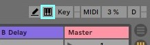
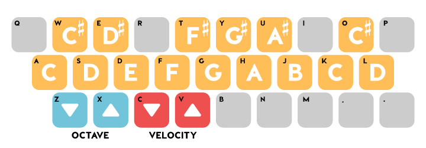
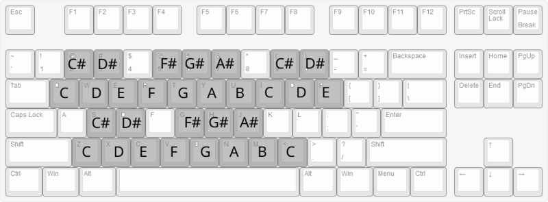
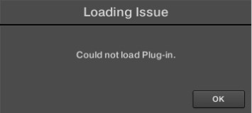

## Latencia

Si esta teniendo problemas de latencia _(un retardo en el tiempo entre oprimir una tecla del piano o hablar por el micrófono y el momento en el cual se reproduce el sonido a traves de los audifonos o parlantes)_. Si esta utilizando windows y no tiene una interface de audio lo más probable es que este problema sea a causa de los drivers de que esta utilizando, por suerte tiene una solucion sencilla y solo reuiqere instalar un driver gratuito y configurarlo correctamente.

Por otro lado si utilizando OSX lo mas probables es que el problema este en la configuración de su DAW y la solución es aun más sencilla ya que no requiere descargar ningún software externo y es solo cambiar un par de opciones dentro de las preferencias de su DAW.

- ### Windows con interface

  Si esta utilizando una interface de audio primero debe hacer es asegurarse de de estar utilizando la versión más reciente de los drivers de la interface. para esto busque en google el nombre de su interface mas la palabra **drivers** y asegurese de descargarlos desde la página oficial Ejemplo: `focusrite 2i2 drivers`.

  Una vez instalados los drivers abrir el panel de configuración de la interface y en la pestaña de selección de tamaño de buffer **(Buffer Size)** seleccionar un valor igual o menor a **512** samples.


 

- Mi recomendación es utilizar un **Buffer Size** entre **64** y **128** samples para grabar y componer, pero al momento de hacer la mezcla y el master utilizar un **Buffer Size** de **2048** o el valor más alto que el driver permita elegir para aprovechar al máximo los recursos del computacionales del equipo.

  Tambien puede acceder al panel de configuración de la interface desde el menu de preferencias del DAW. Para acceder a este menu abra su DAW, entre a las preferencias `ctrl + ,` en ableton live o ir a `opciones > preferencias` y ubicar la pestaña de audio en la pestaña de "Driver" seleccionar "ASIO", en la pestaña "Dispositivo de Audio (Audio Device)" seleccionar su interface `E.j: Focusrite 2i2`, una vez seleccionado el Driver y el Dispositivo de Audio hacer click en el botón de "Hardware Setup" y seleccionar un Buffer Size apropiado.
   
   

- ### Windows sin interface

  {: #windows-sin-interface}

  En el caso de no tener una interface de audio lo primero que debe hacer es descargar e instalar la versión más reciente de [ASIO4ALL](https://www.asio4all.org/),
  una vez finalizada la instalación reinicie el equipo.

  Luego de este proceso ejecute su DAW _(En este caso voy a demostrar en Ableton Live pero el proceso es muy parecido en otros DAWS)_, abra las preferencias con `ctrl + ,` o desde `opciones > preferencias` y seleccione la pestaña de **audio**, en la sección de "Driver" seleccione "ASIO" y en la sección "Dispositivo de Audio (Audio Device)" seleccione "ASIO4ALL", una vez seleccionado el driver y el dispositivo de audio hacer click en el boton de hardware setup y seleccioner un Buffer Size apropiado para bajar el slider a **128** samples.

  En este punto la latencia debe de estar a un nivel aceptable para poder producir música de manera cómoda y agradable.



- ### OSX

  Para OSX el procedimiento es muy parecido al que se sigue en windows pero gracias al los Drivers de audio propios del sistema operativo es un poco mas sencillo de controlar la latencia del sistema.

  Reducir la latencia en OSX es usualmente un problema con el **Buffer Size** especificado en el DAW, por lo cual se puede solucionar directamente desde el panel de preferencias del mismo. Para seleccionar un **Buffer Size** hay que:

  1. Entrar en las preferencias de audio, en el caso de Ableton Live el atajo es `cmd + ,`
  2. Ir a la pestaña de "Audio" y seleccionar en "Driver" **Core Audio** y en "Dispositivo de Audio" La salida de audio que quiera utilizar, sea de una interface o la integrada del sistema
  3. En la sección de **"Buffer Size"** seleccionar un tamaño apropiado según la tareaa que se quiera realizar en el momento.



---

## Controladores MIDI virtuales

En algunas ocasiones nos vemos en la necesidad de querer explorar un nuevo vst, una idea melodica o una armonia sin tener que crear un clip midi e introducir la informacion de manera manual, pero no tenemos un controlador MIDI al alcance. Para estas situaciones siempre podemos utilizar el **Teclado MIDI Virtual** incluido en el DAW.

Como activarlo:

- ### Ableton Live

  En Ableton Live existen varias maneras para activar o descativar el declado virtual:

  1. Oprimir la tecla `M` para activar o desactivar el teclado virtual.
  2. Ir a `opciones > teclado MIDI del Computador` para activar o desactivar el teclado virtual.
  3. Hacer click en el símbolo de teclado en la esquina superior derecha junto al botón de `key`
     

  Con cualquiera de estas opciones ya tenemos disponible un teclado de una octava al cual se le puede variar la altura con las teclas `X` y `Z` respectivamente
  

  Imagen tomada de [soundfly.com](https://flypaper.soundfly.com/produce/make-your-first-beat-in-ableton-live-making-sound-recording-midi/)

    

- ### Reaper

  Al igual que Ableton Live, Reaper ofrece un **_"piano"_** virtual con el teclado del computador, pero en el caso de Reaper este **_"piano"_** ofrece una mayor cantidad de notas 2 octavas y 4 notas haciendo uso de una mayor cantidad de teclas y utilizando una distribución diferente a la de Ableton Live.

  Para activar el teclado virtual existen dos opciones:

  1. Ir a `View > Virtual Midi Keyboard`
  2. Oprimir la combinación`Alt+B`

   
  Imagen tomada de [Cockos Forum](https://forum.cockos.com/showthread.php?t=222635)



## Problemas al instalar plugins

La mejor opción en caso de estar teniendo problemas con la instalación de un plugin es seguir la guia oficial del fabricante.

- ### Komplete Start

  En caso de recibir la el mensaje `Loading Issue` al momento de cargar plugins en **Komplete Kontrol**:

  

  [Guia oficial de Native instruments para solucionar este problema](https://support.native-instruments.com/hc/es/articles/210276165-Mensaje-de-error-de-KOMPLETE-KONTROL-Loading-Issue-Could-not-load-Plug-in-Windows-)

     

- ### Spitfire

  [Guia oficial](https://spitfireaudio.zendesk.com/hc/en-us/sections/200995409-LABS) de spitfire para solucion de los problemas posibles con la libreria de labs

<!-- ### Smartphone como controlador midi

Otra buena opcion y que nos permite tener diferrentes superficies de control en un solo dispositivo es utilizar un smartphone o una tablet
como controlador midi.

En el mercado existen muchas opciones de aplicaciones para conseguir este objetivo tanto para Android como para IOS, pero aqui solo vamos a
mencionar las opciones gratuitas y como utilizarlos con Windows O OSX -->
